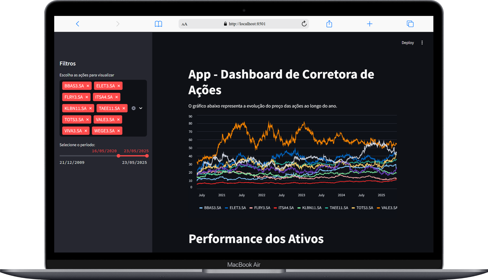
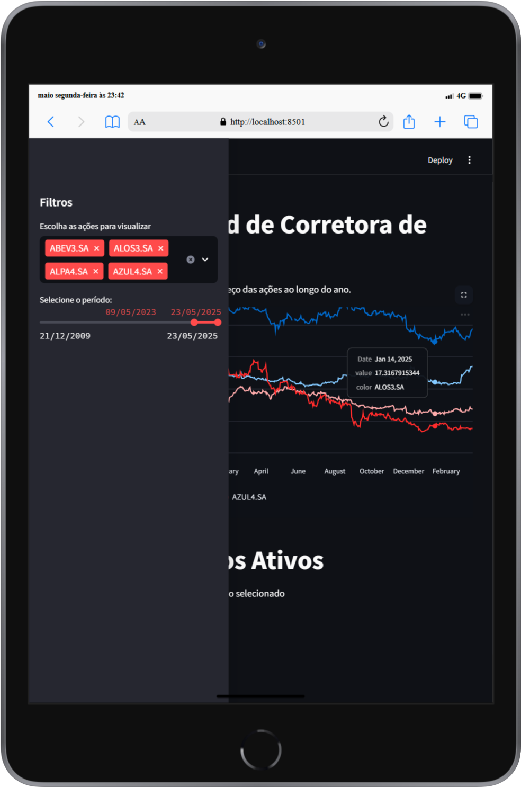
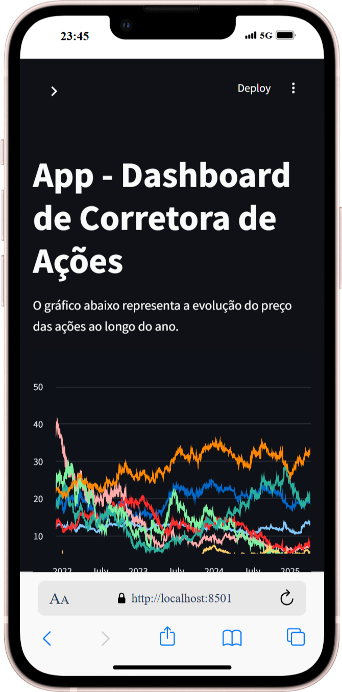

# App - Dashboard de Corretora de Ações

## Descrição
Este projeto foi feito para melhorar minhas habilidades como desenvolvedor fullstack, usando na prática algumas tecnologias que já conheço.<br>
Ele foi inspirado em um vídeo da Hashtag Programação no YouTube, onde eles ensina como usar o Streamlit junto com outras ferramentas para criar uma Dashboard para análise de ações.<br>

Você pode assistir o 1° vídeo aqui (são 4 aulas):<br>
[Curso de Streamlit - Aula 1 - Como Funciona Criar Apps e Sites com o Streamlit](https://www.youtube.com/watch?v=NsjA-c8596k)

## O que é o App - Dashboard de Corretora de Ações ?
É uma dashboard voltado para a análise de ações, utilizando a biblioteca yfinance para acessar dados financeiros históricos e em tempo real disponibilizados pelo Yahoo Finance.<br>
Você poderá selecionar para filtrar por ações, período de data e visualizar essas informações em um gráfico.<br>
Exibe a performance de cada ativo selecionado com base no período de data escolhido, além do desempenho da carteira completa, considerando um investimento hipotético de R$ 1.000,00 em cada ativo.

## Aviso sobre o arquivo `IBOV.csv`
O arquivo contém 86 empresas listadas, não representando a lista completa da bolsa de valores que passa de 400.<br>
As ações incluídas servem apenas para demonstrar as funcionalidades do dashboard.<br>

## Objetivos:
- Mostrar minhas habilidades técnicas com Streamlit, Python, Pandas, Plotly e mais.
- Aplicar princípios de Clean Code, organização de pastas e mais.
- Ajudar iniciantes com códigos simples, legíveis e prontos para estudo.
- Apresentar meu estilo de trabalho para recrutadores e empresas de tecnologia.

## Funcionalidades
- [x] Sidebar com filtros para seleção de ações e definição de um período por data inicial e final.
- [x] Layout responsivo para Desktop, Tablet e Mobile.

## Tecnologias Utilizadas
- Python: Linguagem de programação principal utilizada para desenvolvimento do frontend/backend e manipulação de dados.
- Streamlit: Framework em Python para criação de aplicações web interativas e voltadas à visualização de dados.
- Plotly: Biblioteca interativa de visualização de dados em gráficos para Python.
- Pandas: Biblioteca Python para análise e manipulação de dados, especialmente em estruturas como DataFrames.
- yfinance: Biblioteca para acessar dados financeiros históricos e em tempo real disponibilizados pelo Yahoo Finance.

## 📸 Screenshots
<div align="center">
  <h3>Versão para Desktop</h3>
  
</div>
<br>

<div align="center">
  <h3>Versão para Tablet</h3>
  
</div>
<br>

<div align="center">
  <h3>Versão para Mobile</h3>
  
</div>

##  Como rodar o projeto localmente
## Clone o repositório
```bash
git clone https://github.com/jcddsj01/app-dashboard-corretora-acoes
```

## Acesse a pasta do projeto
```bash
cd app-dashboard-corretora-acoes
```

## Crie um ambiente virtual
Sistema Windows (cmd)
```bash
python -m venv nome-ambiente
```
Sistema Linux
```bash
python3 -m venv nome-ambiente
```

## Ativar o ambiente virtual
Sistema Windows (cmd)
```bash
nome-ambiente\Scripts\activate
```
Sistema Linux
```bash
source nome-ambiente/bin/activate
```

## Instale as dependências 
Sistema Windows (cmd) e Linux
```bash
pip install -r requirements.txt
```

## Inicie o servidor Streamlit
```bash
streamlit run main.py
```

## 📁 Estrutura de Pastas
📦public<br>
 ┗ 📂screenshots<br>

## Deploy (Frontend)
O projeto está disponível online no Streamlit Community Cloud:<br>
https://app-dashboard-corretora-acoes-zkwfy9n2brrxt8jitojkte.streamlit.app/

Para conhecer o Streamlit Community Cloud:<br>
https://streamlit.io/cloud

## Contato
Sinta-se à vontade para me contatar através dos links abaixo:<br>
E-mail - jcddsj01@outlook.com<br>
Linkedin - https://www.linkedin.com/in/jose-carlos-703821254/

## Licença<br>
MIT License. Você pode usar este projeto como referência para criar o seu próprio portfólio.

---

# App - Stock Broker Dashboard

## Description
This project was made to improve my skills as a fullstack developer, using in practice some technologies that I already know.<br>
It was inspired by a video from Hashtag Programação on YouTube, where they teach how to use Streamlit together with other tools to create a Dashboard for stock analysis.<br>

You can watch the 1st video here (there are 4 classes):<br>
[Curso de Streamlit - Aula 1 - Como Funciona Criar Apps e Sites com o Streamlit](https://www.youtube.com/watch?v=NsjA-c8596k)

## What is the Stock Broker Dashboard App?
It is a dashboard focused on stock analysis, using the yfinance library to access historical and real-time financial data provided by Yahoo Finance.<br>
You can select to filter by stock, date period and view this information in a graph.<br>
It displays the performance of each selected asset based on the chosen date period, in addition to the performance of the entire portfolio, considering a hypothetical investment of R$1,000.00 in each asset.

## Notice about the `IBOV.csv` file
The file contains 86 listed companies, and does not represent the complete list of the stock exchange, which has over 400.<br>
The shares included are only used to demonstrate the dashboard's features.<br>

## Objectives:
- Show my technical skills with Streamlit, Python, Pandas, Plotly and more.
- Apply Clean Code principles, folder organization and more.
- Help beginners with simple, readable and study-ready code.
- Present my work style to recruiters and technology companies.

## Features
- [x] Sidebar with filters for selecting actions and defining a period by start and end date.
- [x] Responsive layout for Desktop, Tablet and Mobile.

## Technologies Used
- Python: Main programming language used for frontend/backend development and data manipulation.
- Streamlit: Python framework for creating interactive web applications focused on data visualization.
- Plotly: Interactive data visualization library in graphics for Python.
- Pandas: Python library for data analysis and manipulation, especially in structures such as DataFrames.
- yfinance: Library for accessing historical and real-time financial data provided by Yahoo Finance.

## 📸 Screenshots
<div align="center">
  <h3>Desktop version</h3>
  
</div>
<br>

<div align="center">
  <h3>Tablet version</h3>
  
</div>
<br>

<div align="center">
  <h3>Mobile version</h3>
  
</div>

## How to run the project locally
## Clone the repository
```bash
git clone https://github.com/jcddsj01/app-dashboard-corretora-acoes
```

## Access the project folder
```bash
cd app-dashboard-corretora-acoe
```

## Create a virtual environment
Windows system (cmd)
```bash
python -m venv name-environment
```
Sistema Linux
```bash
python3 -m venv name-environment
```

## Activate the virtual environment
Windows system (cmd)
```bash
name-environment\Scripts\activate
```
Linux system
```bash
source name-environment/bin/activate
```

## Install the dependencies 
Windows (cmd) and Linux systems
```bash
pip install -r requirements.txt
```

## Start the Streamlit server
```bash
streamlit run dashboard.py
```

## 📁 Folder Structure
📦public<br>
 ┗ 📂screenshots<br>

## Deploy (Frontend)
The project is available online on the Streamlit Community Cloud:<br>
https://app-dashboard-corretora-acoes-zkwfy9n2brrxt8jitojkte.streamlit.app/

To learn more about the Streamlit Community Cloud:<br>
https://streamlit.io/cloud

## Contact me
Feel free to contact me via the links below:<br>
E-mail - jcddsj01@outlook.com<br>
Linkedin - https://www.linkedin.com/in/jose-carlos-703821254/

## License<br>
MIT License. You can use this project as a reference to create your own portfolio.
